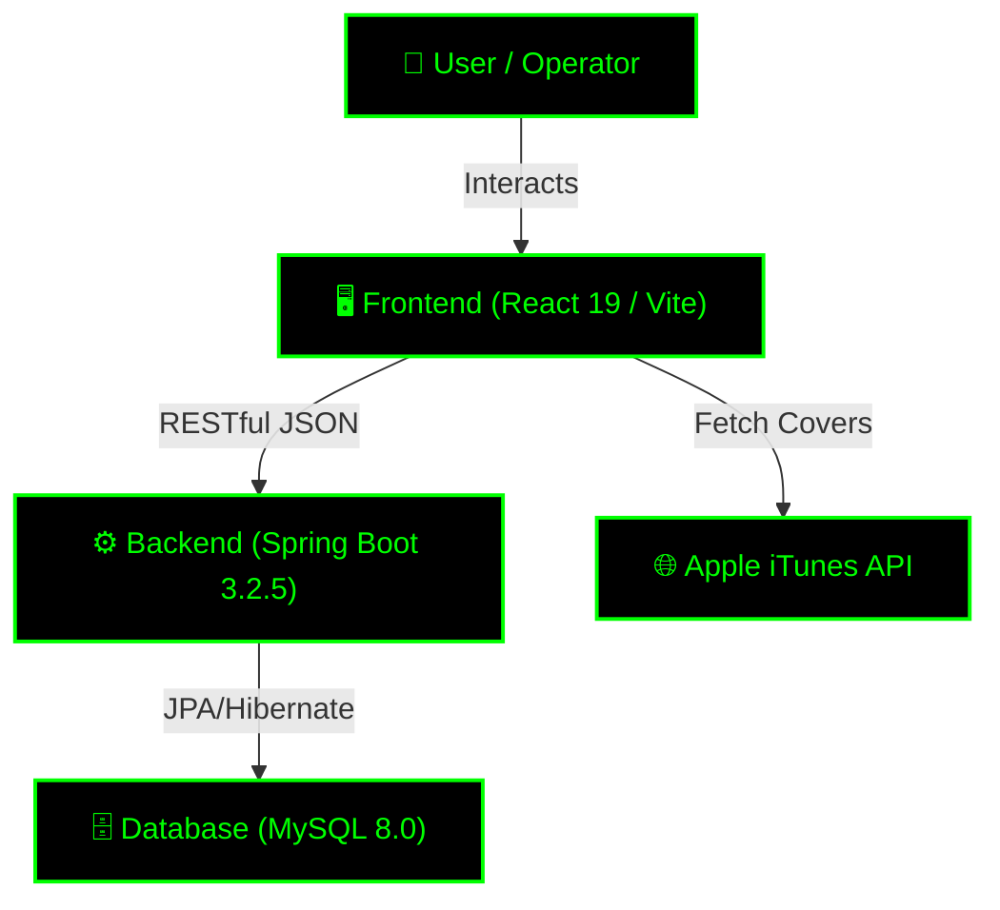

<div align="center">
  <h1>🕶️ RARE FINDS // B.M.S. [v2.0] 🟢</h1>
  <p><i>"Wake up, Neo... The Bookstore Management System has you."</i></p>

  [](https://github.com)
  [](https://react.dev)
  [](https://spring.io/)
  [](https://mysql.com)
</div>

---

## 💾 [ SYS.INFO ]

Welcome to the **Rare Finds Bookstore Management System (BMS)**. Forged in the depths of the Matrix, this dual-node architecture (Split Frontend/Backend) streamlines inventory, secures user management, and processes digital currency exchanges (Sales).

## 🏗️ [ ARCHITECTURE CONSTRUCT ]



## 🔋 [ TECH STACK ]

### // FRONTEND_NODE
* **Framework:** React 19 (SPA) powered by Vite
* **Routing:** React Router DOM
* **Visuals:** Recharts (Analytics), Native 3D CSS Flip Cards, Apple iTunes API (Book Covers)
* **Styling:** Vanilla CSS (Dark-mode Cyberpunk aesthetic)

### // BACKEND_MAINFRAME
* **Core:** Java 17 + Spring Boot 3.2.5
* **Database:** MySQL / Spring Data JPA
* **Security:** Spring Security (BCrypt Hashing, RBAC)
* **Utilities:** Lombok

---

## 🔌 [ JACKING IN (INSTALLATION) ]

### // PREREQUISITES
You will need the following programs loaded into your cortex:
* **Java 17** (or higher)
* **Maven 3.8+**
* **MySQL 8.0+**
* **Node.js** (for frontend package management)

### // INITIALIZATION SEQUENCE

**1. Clone the Construct:**
```bash
git clone <repository_url>
cd CS491-Bookstore-Product
```

**2. Database Uplink (MySQL):**
* Ensure your local MySQL daemon is running.
* The system will auto-generate the schema on boot. DDL override scripts can be found at `src/main/resources/schema.sql`.

**3. Boot the Mainframe (Backend):**
```bash
cd backend
mvn spring-boot:run
```
> *API Matrix is accessible at: `http://localhost:8081`*

**4. Compile the UI (Frontend):**
```bash
cd ../frontend
npm install
npm run dev
```

### // DEFAULT ACCESS TOKENS (TEST USERS)
* `admin` / `password` (God Mode)
* `manager` / `password` (Supervisor)
* `clerk` / `password` (Standard Ops)

---

## 🦾 [ SYSTEM CAPABILITIES ]

* 🔐 **Secure Auth Protocol:** BCrypt-hashed credentials with Role-Based Access Control (RBAC).
* 🗃️ **Inventory Mainframe:** Full CRUD operations for books, complete with a smart Search & Filter UI.
* 💳 **Sales Processing Node:** Dynamic CartDrawer, real-time transaction processing, and automated inventory sync.
* 📊 **Analytics Dashboard:** Visual revenue metrics powered by Recharts, restricted to Admins & Managers.
* 🏢 **Supplier Link:** Manage vendor relationships and trigger one-click inventory restocks.
* 🛠️ **Admin Tools Suite:** Manage users, monitor system logs, adjust global variables, and download raw CSV data streams.

---

<div align="center">
  <p><i>Developed by Team Rare Finds ⚡ End of Line.</i></p>
</div>
